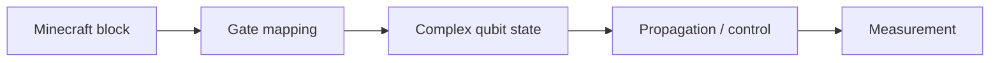

# QuantumCraft: The Blockverse Simulator

Minecraft 블록을 양자 게이트로 사용해 회로를 직접 배치하고, 복소수
확률 진폭의 전파와 측정을 게임 안에서 확인하는 Java/Bukkit 기반 교육용
양자 회로 시뮬레이터입니다.


## 왜 Minecraft인가

행렬과 복소수만으로 양자 회로를 처음 배우면 gate의 연결과 상태 변화를
직관적으로 추적하기 어렵습니다. QuantumCraft는 블록 위치와 연결을 회로
topology로 사용해, 플레이어가 회로를 직접 걸어 다니며 수정하고 각 지점의
상태를 확인하도록 설계했습니다.

## 핵심 기능

- X, Y, Z, Hadamard 및 사용자 정의 2×2 gate
- Apache Commons Math `Complex`를 이용한 qubit 진폭과 matrix 연산
- 블록 배치 방향을 따라 실시간으로 전파되는 quantum state
- control signal을 이용한 conditional gate와 entanglement 표현
- Born rule을 바탕으로 한 measurement 분기
- 블록 클릭 시 각 위치의 `|0⟩`, `|1⟩` 계수와 제어 상태 표시
- 잘못된 연결과 블록 제거 시 계산 상태 정리



## 블록과 연산

| 블록 | 역할 |
|---|---|
| Coal | qubit 시작점 |
| Bone | 측정 종점 |
| Emerald / Copper / Diamond / Gold | X / Y / Z / H gate |
| Quartz | 사용자 정의 gate A |
| Redstone | control signal |
| Stained Glass | 상태 전파 경로 |

## 명령어

| 명령 | 설명 |
|---|---|
| `/qskit` | 회로 구성에 필요한 블록 kit 지급 |
| `/qsinit <a+bi> <c+di>` | 초기 qubit 상태 설정 및 정규화 |
| `/customgate <a+bi> <c+di> <e+fi> <g+hi>` | 사용자 정의 2×2 gate 설정 |

## 실행

요구 사항:

- JDK 8+
- Maven
- Spigot 1.20.2 호환 서버

```bash
mvn package
```

생성된 `target/qcompplugin-1.0-SNAPSHOT.jar`를 Spigot 서버의 `plugins/`
디렉터리에 복사하고 서버를 시작합니다. 월드 이름은 코드에서 `world`로
설정되어 있습니다.

## 예시 회로

### Bell-state 형태의 entanglement


두 qubit의 `|0⟩`과 `|1⟩` 계수가 약 `1/√2`로 표시되며, 블록을
클릭하면 측정 결과별로 영향을 받는 다른 qubit 상태를 확인할 수 있습니다.

### Deutsch 문제의 quantum oracle

<p>
  
  
</p>

constant/balanced oracle를 블록으로 구성해 최종 입력 qubit의 측정 확률이
어떻게 달라지는지 비교할 수 있습니다.

## 코드 구조

| 파일 | 책임 |
|---|---|
| `Qcomp.java` | Bukkit event, command, 회로 탐색과 상태 전파 |
| `Qubit.java` | 복소수 진폭, 정규화, 측정 |
| `Qstate.java` | 데이터/control state와 조건부 영향 관계 |
| `Gate.java` | 표준 및 사용자 정의 gate matrix |
| `MetaManager.java` | Minecraft block metadata 관리 |

## 팀

Group QD — Byungchul Kim, Chaehoon Park, Nohyoon Park, Taewoo Lee

## 범위와 한계

QuantumCraft는 범용 양자 컴퓨터가 아니라 학습용 회로 시뮬레이터입니다.
대규모 register, noise model, 실제 quantum hardware backend는 지원하지
않습니다.
